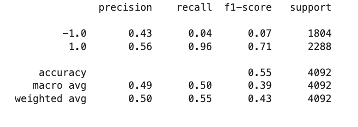
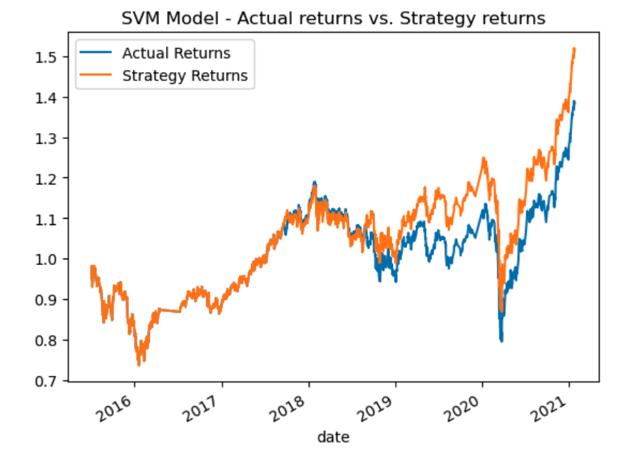
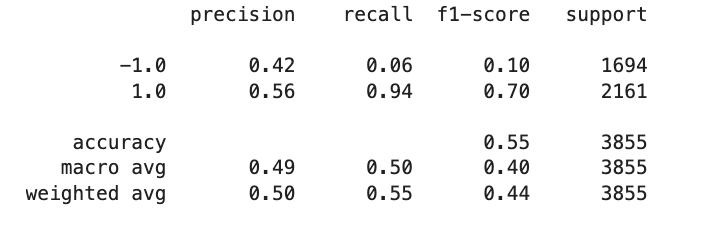
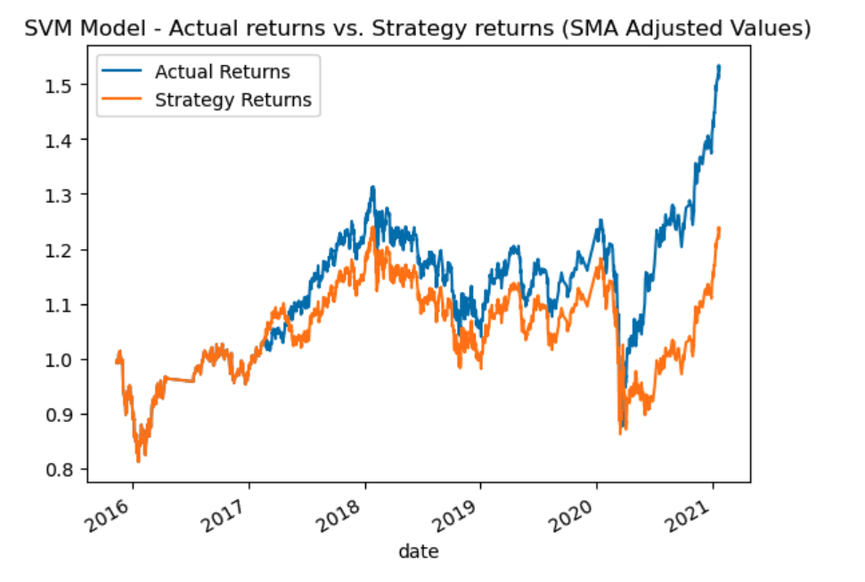
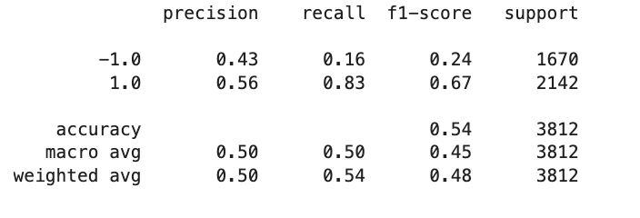
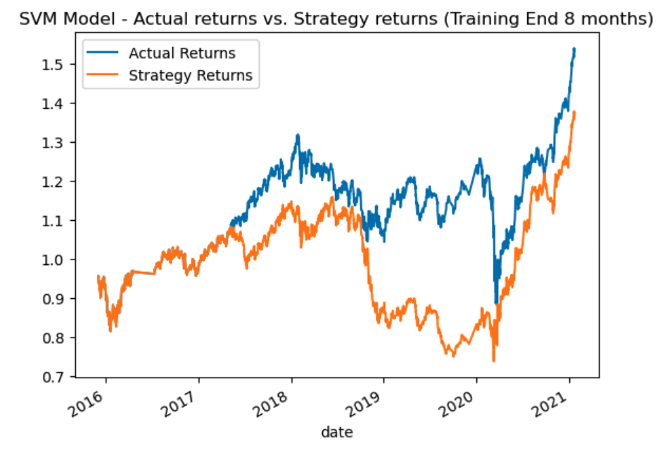
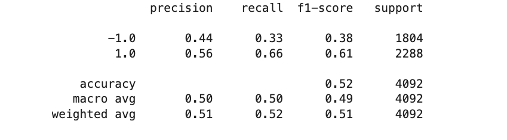
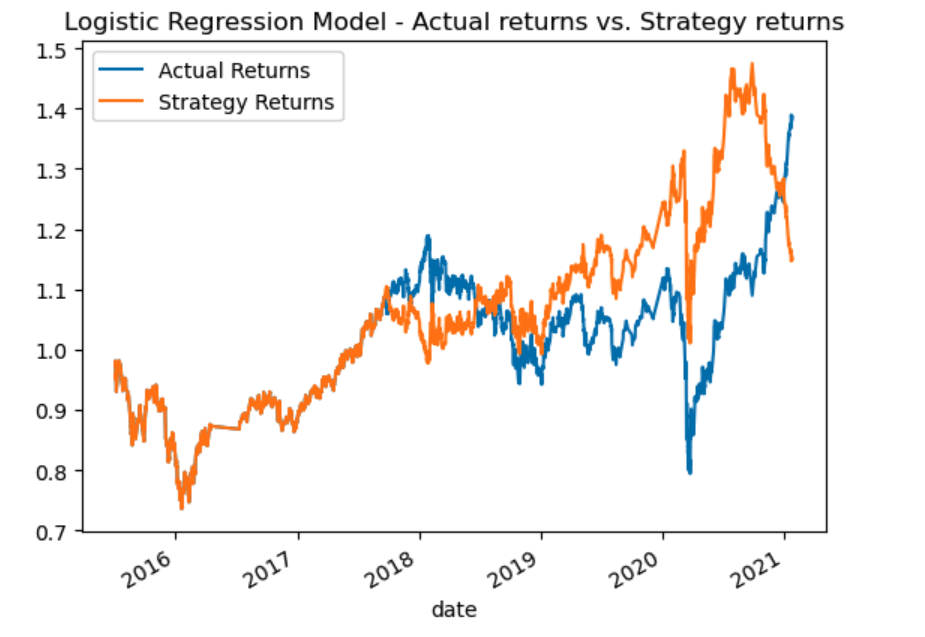

# Machine Learning Trading Bot

## Overview 

The goal of this assignment was to act as a financial advisor at a top-five global financial advisory firm and enhance existing algorithmic trading strategies to maintain and surpass the firm's competitive edge in the market. This involved establishing a performance baseline with the current trading algorithm, refining it, introducing a new machine learning classifier, and assessing its impact on performance improvement.

## Table of Contents 

* Establish a Baseline Performance
* Tune the Baseline Trading Algorithm
* Evaluate a New Machine Learning Classifier

## Establish a Baseline Performance 

### Baseline Performance 

The trading algorithm exhibits a promising ability to identify and capitalize on positive trading opportunities (class 1.0) with a high precision, recall, and F1-score, indicating its effectiveness in this aspect. However, it struggles to correctly identify and act upon negative trading signals (class -1.0) as evidenced by low precision, recall, and F1-score for this class. The overall accuracy of 55% suggests that while the algorithm performs better than random guessing, it may require further refinement, particularly in its handling of downside risk. Additional measures, such as optimizing risk management strategies, may be necessary to enhance its overall performance and stability in a trading context.

## Tune the Baseline Trading Alogrithm 

### Adjusted SMA Window (Decreased SMA Short Window From 4-Days to 2-Days & Increased SMA Long Window From 100-Days to 200-Days)

After tuning the algorithm by reducing the SMA short window from 4 days to 2 days and increasing the SMA long window from 100 days to 200 days, some minor improvements have been observed. The precision for class -1.0 has slightly increased from 0.43 to 0.42, and the recall for this class has risen from 0.04 to 0.06. However, these metrics remain relatively low, indicating that the algorithm is still not very accurate in identifying negative trading signals. On the other hand, precision, recall, and the F1-score for class 1.0 have remained relatively stable at 0.56, 0.94, and 0.70, respectively. The overall accuracy remains unchanged at 0.55. In summary, while there have been some marginal improvements, the algorithm's overall performance still favors positive trading opportunities but struggles to accurately identify and act upon negative signals. 

### Adjusted Training Window (Increased Training End from 3-Months to 8-Months)

Extending the ending period for training data from 3 months to 8 months has yielded notable improvements in the algorithm's performance. Precision for class -1.0 has increased from 0.42 to 0.43, signifying better accuracy in identifying negative trading signals, and recall for class -1.0 has seen a significant boost from 0.16 to 0.24, indicating a better ability to capture -1.0 instances. The F1-score for class -1.0 has also improved, resulting in a more balanced trade-off between precision and recall. However, there is a slight decrease in overall accuracy from 0.55 to 0.54, suggesting the possibility of an increased number of false positives. While the algorithm excels in identifying positive trading opportunities (class 1.0), further refinement may be needed to achieve a more balanced and robust performance in the context of trading.

### Parameters That Best Improved The Algorithm 

The tuned algorithm, after extending the ending period for training data from 3 months to 8 months, performs better in terms of precision, recall, and F1-score for the negative trading signals (class -1.0) compared to the baseline.

The improvements in precision (0.42 to 0.43), recall (0.16 to 0.24), and F1-score (0.07 to 0.10) for class -1.0 indicate a better ability to correctly identify and capture negative trading instances. However, the trade-off is a slight decrease in overall accuracy (from 0.55 to 0.54) due to a lower recall for class 1.0.

If the primary goal is to enhance the model's ability to handle downside risk and make more accurate predictions for negative signals, the tuned algorithm is performing better in this specific context. However, the choice between the baseline and the tuned algorithm depends on the specific objectives and trade-offs of the trading strategy.

## Evaluate a New Machine Learning Classifier 

### Logistic Regression Model 

In comparison to the baseline SVM model, the Logistic Regression model exhibits notable improvements in performance for the trading algorithm. The Logistic Regression model demonstrates higher precision, recall, and F1-scores for both positive and negative trading signals, highlighting its enhanced ability to make accurate predictions and capture trading instances. While the overall accuracy is slightly lower than the SVM model, it indicates that the Logistic Regression model provides a more balanced approach with less bias toward the majority class. These findings suggest that the Logistic Regression model is better suited for this trading context, offering a promising solution to enhance trading algorithm performance. 
